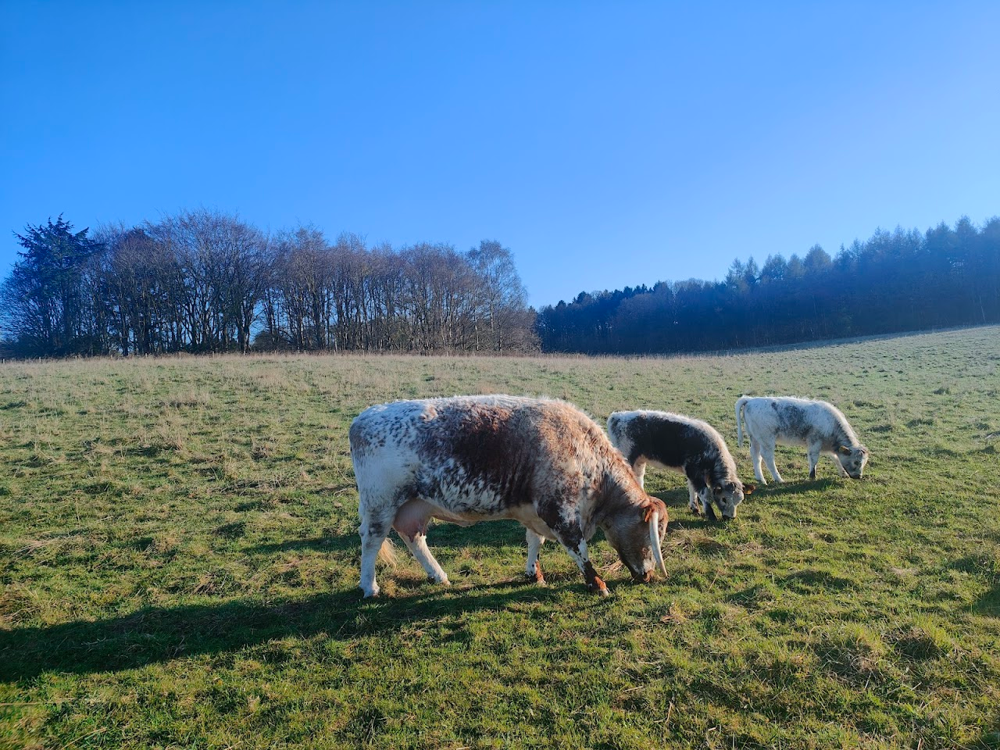
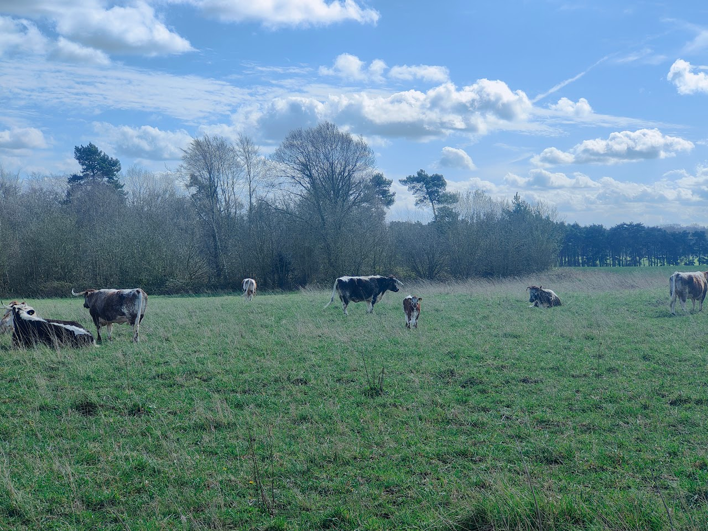
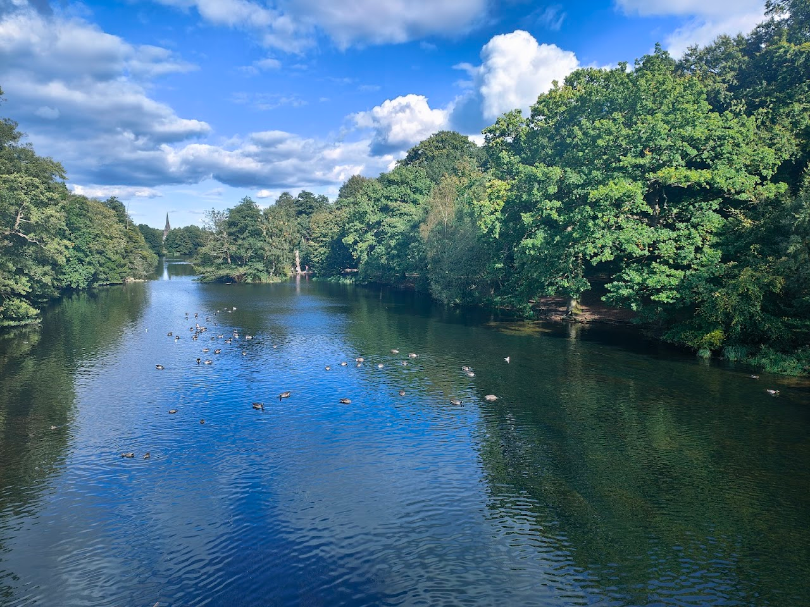
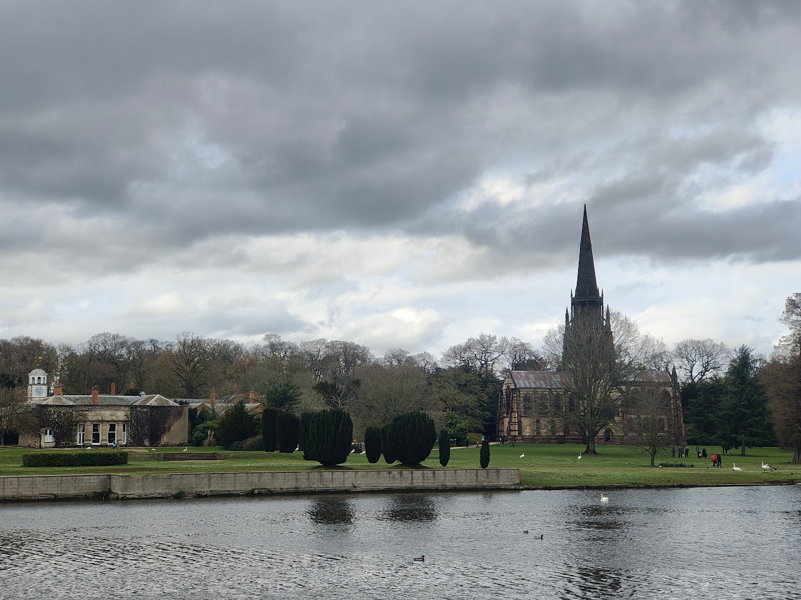

Carved out of the ancient forest of Sherwood, Clumber Park is a beautiful expanse of parkland, heath and woods covering more than 3,800 acres. 

For over three centuries, Clumber Park was the country estate of the Dukes of Newcastle. Although the house was taken down in 1938, there are many glimpses of its grand past to explore. From the Gothic-style chapel, often referred to as a 'cathedral in miniature', you can follow in the footsteps of the dukes through the peaceful Pleasure Grounds to the walled kitchen garden where you can experience sights, scents and a taste of the past.

Today, Clumber offers freedom to discover a ducal park. Explore picturesque parkland and gardens, peaceful woodlands and a magnificent lake. Not only is Clumber's mosaic of habitats home to an amazing array of wildlife, it is also a great place to spot it. 

There is so much to see and do here with the park providing the perfect backdrop for relaxing, exploring and spending time in nature.

[National Trust, 2025](https://www.nationaltrust.org.uk/visit/nottinghamshire-lincolnshire/clumber-park).
### Some Cows

### More Cows

### Ducks

### Church & House
