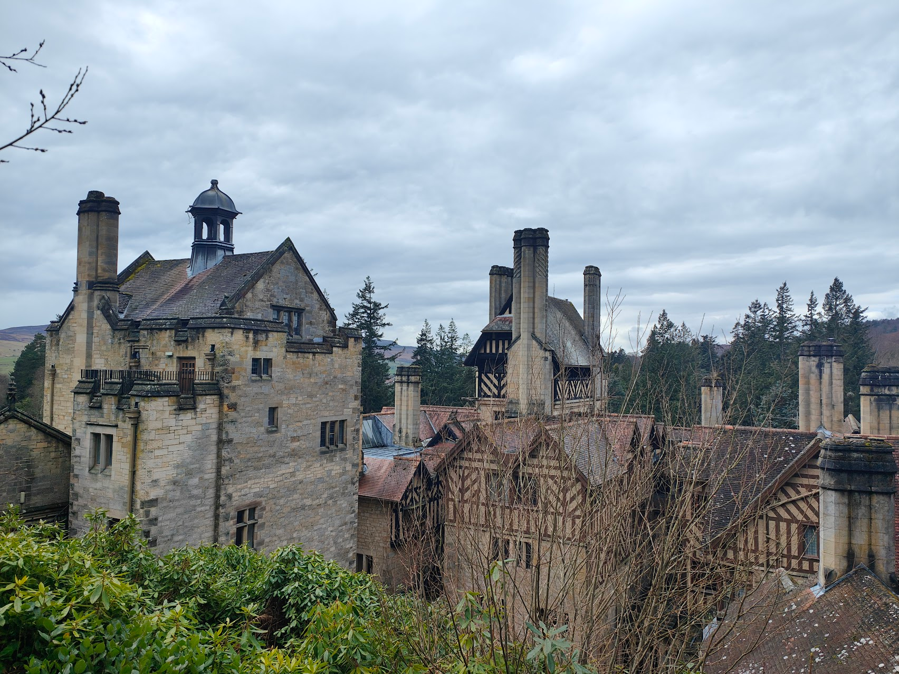
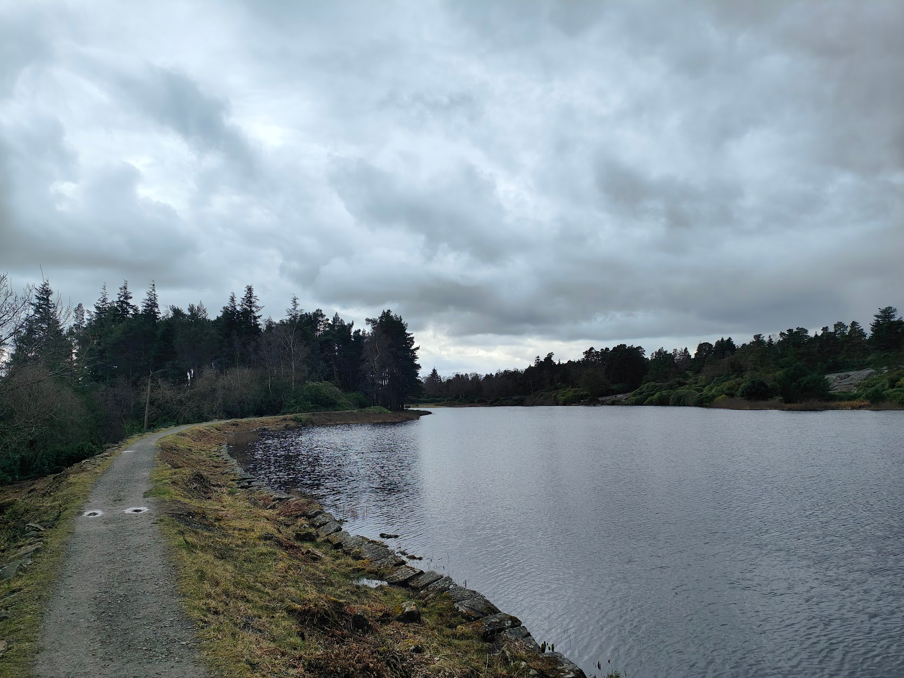

Illuminated by hydro-electricity and powered by hydraulics, this pioneering home was filled with Victorian gadgets for efficient modern living. Man-made lakes, tumbling waterfalls and swathes of rhododendron combine to form the surrounding fantasy mountain landscape imagined and engineered by inventor and arms manufacturer William Armstrong and his wife Margaret.

You can wander amongst the towering trees in the Pinetum, explore the weaving paths and tumbling cascades in the Rock Garden and witness the changing seasons in the Formal Garden. See the whole estate by car on the Carriage Drive where way-marked walks and wildlife are waiting to be discovered. Families can adventure through the labyrinth, building a grand design in the den building area and swoop and slide at play area too. 

[National Trust, 2025](https://www.nationaltrust.org.uk/visit/north-east/cragside).

### The House

### Nice Scenery

